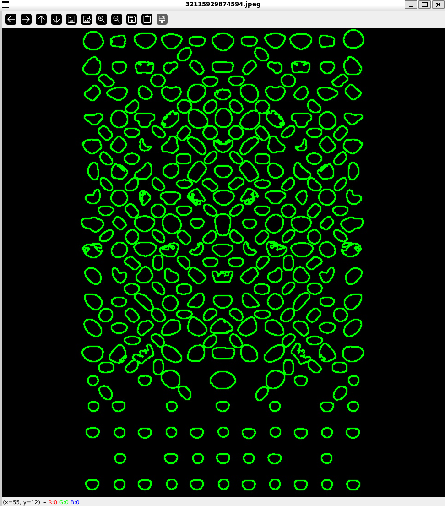

[](https://github.com/gongahkia/cornifer/releases/tag/1.0.0) 

# `Cornifer`

The [little bug](https://www.reddit.com/r/HollowKnight/comments/n646h6/iis_it_really_you_cornifer/) that could (make anything a spray wall).

## Rationale

Cooked this up over a 2-day period to [benchmark](https://makemeaprogrammer.com/what-is-benchmarking/) myself as a programmer.


## Screenshot





## Layout

| File / Folder name | Purpose |
| :--- | :--- |
| [`scrapers`](./src/scrapers/) | Web Scrapers|
| [`generated_log`](./src/generated_log/) | Log data |
| [`corpus`](./src/corpus/) | Raw and cleaned image corpus |
| [`model`](./src/model/) | Style classification model |
| [`vision`](./src/vision/) | OpenCV hold thresholding and detection |

## Usage

### Scrapers

```console
$ git clone https://github.com/gongahkia/cornifer
$ make config
$ cd src/scrapers/
$ make
```

### Cornifer application

```console
$ git clone https://github.com/gongahkia/cornifer
$ make config
$ cd src/vision/
$ make
```

## Architecture

### DB

Processed holds are stored in [ChromaDB](https://www.trychroma.com/) per the below schema.

```mermaid
erDiagram
    HOLD {
        int id PK
        string hold_type
        string shape
        float size
        vector position
        string color
        string texture
        vector embedding
    }
    PROBLEM {
        int id PK
        string name
        string difficulty
        date created_at
    }
    HOLD_PROBLEM {
        int hold_id FK
        int problem_id FK
        int sequence_number
    }
    STYLE {
        int id PK
        string name
        string description
    }
    PROBLEM_STYLE {
        int problem_id FK
        int style_id FK
        float confidence
    }

    HOLD ||--o{ HOLD_PROBLEM : "is part of"
    PROBLEM ||--o{ HOLD_PROBLEM : "consists of"
    PROBLEM ||--o{ PROBLEM_STYLE : "classified as"
    STYLE ||--o{ PROBLEM_STYLE : "classifies"
```

### Overview


## References

The name `Cornifer` is in reference to the wandering mapmaker who aids [the Knight](https://hollowknight.fandom.com/wiki/Knight) by cartographing the kingdom of [Hallownest](https://hollowknight.fandom.com/wiki/Hallownest) from the 2017 game [Hollow Knight](https://hollowknight.fandom.com/wiki/Hollow_Knight_Wiki). [Cornifer](https://hollowknight.fandom.com/wiki/Cornifer) is often accompanied by his wife [Iselda](https://hollowknight.fandom.com/wiki/Iselda) at their shop in [Dirtmouth](https://hollowknight.fandom.com/wiki/Dirtmouth).


## Research

* [*Design of a sensor network for the quantitative analysis of sport climbing*](https://www.frontiersin.org/journals/sports-and-active-living/articles/10.3389/fspor.2023.1114539/full) by Alessandro Colombo, Ramon Maj, Marita Canina, Francesca Fedeli, Nicolo Dozio and Francesco Ferrise
* [*Indoor-Climbing-Hold-and-Route-Segmentation*](https://github.com/xiaoxiae/Indoor-Climbing-Hold-and-Route-Segmentation) Github repository by xiaoxiae

## Datasets

* [*Indoor Climbing Gym Hold And Route Segmentation*](https://www.kaggle.com/datasets/tomasslama/indoor-climbing-gym-hold-segmentation/data) Kaggle dataset by Tomáš Sláma
* [*Climbing Holds and Volumes Computer Vision Project*](https://universe.roboflow.com/blackcreed-xpgxh/climbing-holds-and-volumes) Roboflow dataset by Blackcreed
* [*Bouldering holds Computer Vision Project*](https://universe.roboflow.com/pwals/bouldering-holds-9wavr) by Pwals
* [*CLIMBNET*](https://github.com/cydivision/climbnet) Github repository by cydivision
* [*ClimbDB*](https://github.com/NehaRajganesh/ClimbDB) Github repository by NehaRajganesh
* [*bouldering_route_classification*](https://github.com/tonylay7/bouldering_route_classification) Github repository by tonylay7
